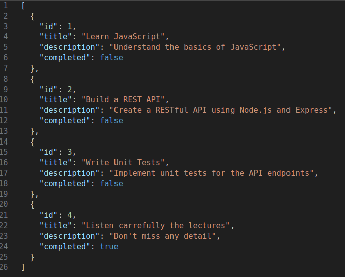
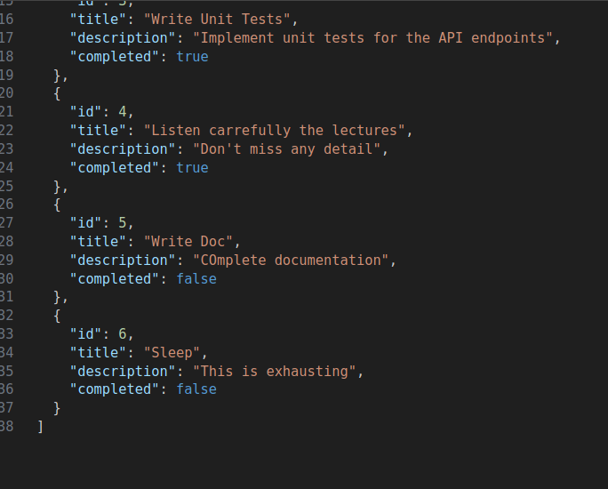
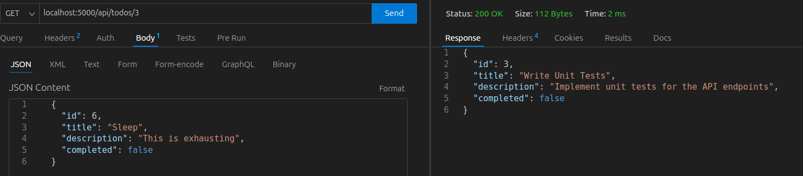

# DevWeb2 - Lab1 : todo

First lab of Dev Web 2

## Activities

### Activity 1

I used 2 `PUT` and 2 `POST` requests to update and add 2 todos.

Before:



After: 



If your requests/modifications do not appear when you consult it again it is because you have reloaded (with autoreload). As the API requests does NOT modify the /data/todo.js file (only what is inside the browser), each you reload, the content is reseted to the content od `data/todo.js`.

### Activity 2

I added this code (after the first `GET` so you still get all tasks if no number is provided):

```js
// GET only one todo
else if (request.url.match(/^\/api\/todos\/([0-9]+)$/) && request.method === 'GET') {
    const id = parseInt(request.url.split('/')[3])
    const todo = todos.find(t => t.id === id)
    if (!todo) {
        response.writeHead(404, { 'Content-Type': 'application/json' })
        response.end(JSON.stringify({ message: 'Todo not found' }))
    } else {
        response.writeHead(200, { 'Content-Type': 'application/json' })
        response.end(JSON.stringify(todo))
    }
```

Here is what it looks like :



### Activity 3

As expected, if you do not change the port in your API client you will get an error : `Connection was refused by the server.`. Every other features will stay exactly the same if you connect to the good port.

### Activity 4